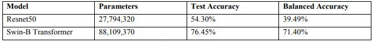

# Diabetic Retinopathy Detection using Deep Learning

## Overview

Millions Diabetic patients often experience a common disease known as Diabetic Retinopathy. This condition predominantly affects the retina, which is the light sensitive tissue located at the back of the eye, by damaging the blood vessels that supply it. While in its early stages, Diabetic Retinopathy may not show any symptoms and can gradually lead to mild vision problems. It is crucial to detect the early stages of thisdisease automatically to prevent damage to the eyes and avoid vision loss. Therefore, the automatic detection of this condition is vital for early screening and diagnosis, which allows for timely treatment. Fundus cameras are used to capture retinal images, which can help in detecting and diagnosing Diabetic Retinopathy .This study proposes a method that utilizes deep learning to automatically identify the progression level of Diabetic Retinopathy. Two different deep learning architectures, namely ResNet, and Swin Transformer, were utilized in the experiment. The models were evaluated in terms of accuracy and network size, and the results were visualized using metrics like confusion matrix. The findings indicate that Swin Transformer can achieve better accuracy and robustness during classification.

### Algortihms Used

1. Resnet
2. Swim transformer
	
Accuracy We got 71% in Swim Transformer. That is Outperforming ResNet50

### Deployment Images
	HomePage

	
	Result	

### Accuracy 

### Packages and Tools Required:
	Python 3.8
	Flask
	Tensorflow
	Keras
	OpenCV
	
## Built with
* Flask
* JavaScript
* CSS
* HTML

## Instructions
1. Install [Python](https://www.python.org/) (v.3.8 is recommended).
1. Clone or download this repository.
1. Using a command prompt/terminal, go the project folder: `/Deploy/`
1. Install the dependencies: 
`pip install -r requirements.txt`
1. Run the server:
`FLASK_APP=app.py FLASK_DEBUG=1 flask run  [port number, default=5000]`
1. Using a web browser, go to `http://127.0.0.1:[port]/`

